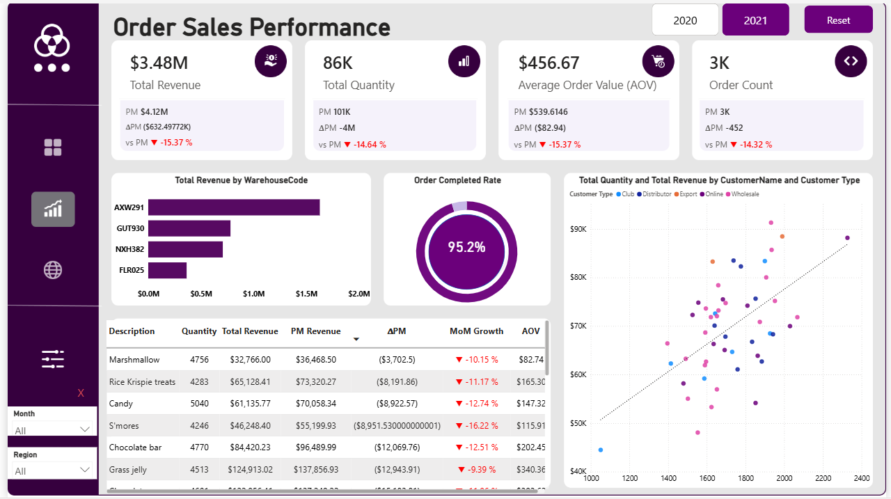
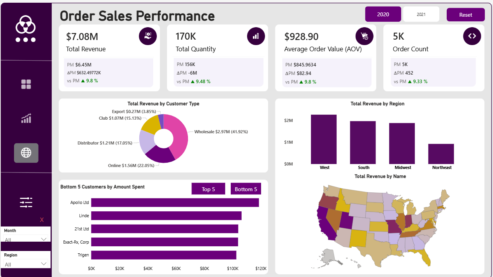

# 📊 Confectionery Sales & Order Performance Analysis

[🚀 **Click Here to View Live Interactive Dashboard**](https://app.powerbi.com/view?r=eyJrIjoiMGNlZGQ5NDUtMmNhZC00NGY4LTg3ZDEtZjIwNTc1MmI0ZTNmIiwidCI6ImRmODY3OWNkLWE4MGUtNDVkOC05OWFjLWM4M2VkN2ZmOTVhMCJ9)

---

## 📖 Project Description
This project is a comprehensive 3-page interactive Power BI suite designed to analyze and optimize confectionery sales performance. Moving beyond basic visualization, the report addresses critical business pillars: **Sales & Demand Trends**, **Operational Efficiency**, and **Regional Intelligence**.

Using a dataset of **$1.89M in total revenue**, I developed over **50 custom DAX measures** to track KPIs like Average Order Value (AOV), Year-over-Year growth, and revenue concentration. The report features a "Sakinah" (orderly) user interface, utilizing advanced **Bookmarks and Buttons** to provide a seamless, app-like navigation experience.

## 🎯 Business Tasks & Solutions
I structured the analysis to solve the following requirements:
* **Sales Health:** Tracking total sales/volumes over time and calculating **Average Order Value (AOV)** to understand transaction quality.
* **Operational Optimization:** Analyzing channel performance and identifying products with declining trends for proactive intervention.
* **Regional Intelligence:** Mapping geographic performance and identifying revenue concentration among top customers to mitigate risk.

## 💡 Strategic Insights Drawn
* **Financials:** Total Revenue of **$1.89M** with an AOV of **$248.24**. **Chocolate Truffles** and **Nougat** are the primary revenue anchors.
* **Operations:** Maintained a strong **95.2% Order Completion Rate**, though items like **Marshmallows** require immediate review due to negative MoM growth.
* **Geography:** The **West Region** is the strongest performer, significantly outperforming the Midwest and Northeast territories.

## 🛠️ Technical Skills Demonstrated
* **Advanced DAX:** Authored 50+ custom formulas for dynamic ranking, time intelligence (YoY/MoM), and complex aggregations.
* **UI/UX Design:** Built a highly interactive workspace using custom **Buttons and Bookmarks** for navigation.
* **Data Modeling:** Optimized a **Star Schema** to ensure high performance across multi-dimensional filters.

## 📸 Dashboard Gallery

*Figure 1: Executive Dashboard featuring high-level KPIs and Sales Trends.*

*Figure 2: Diagnostic view of operational efficiency and product growth.*

*Figure 3: Mapping regional strengths and customer revenue concentration.*

---
## 📂 Repository Structure
* **Sales_order Data.xlsx**: Raw transactional dataset.
* **Confectionery Order Sales Dashboard.pbix**: Complete Power BI file including data model and DAX.
* **Business Questions.docx**: Original project requirements and business tasks.
